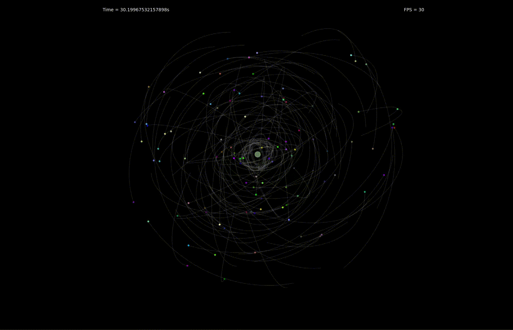
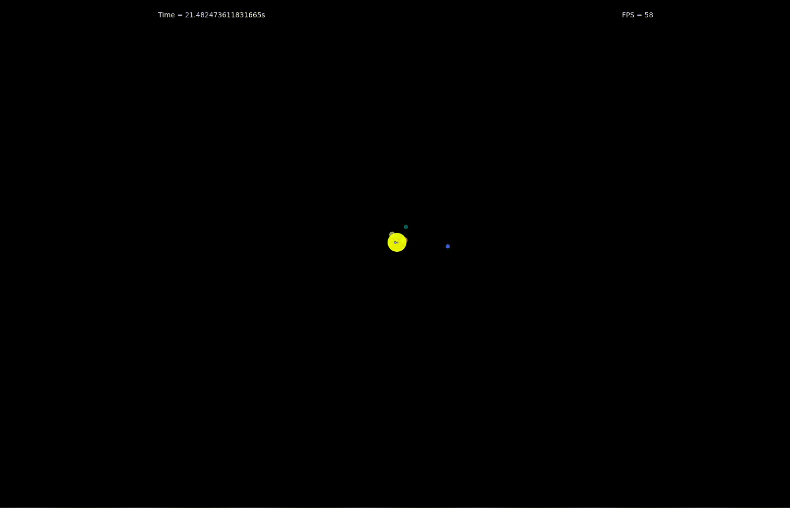
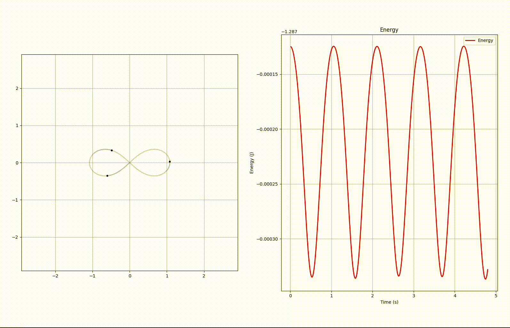
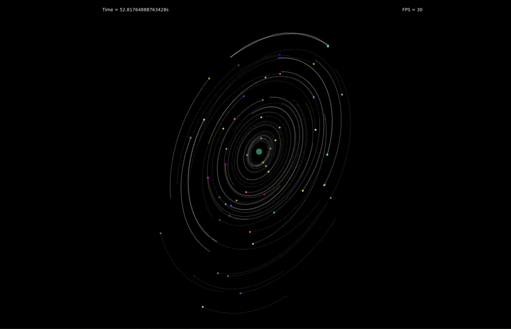

This project contains 2d and 3d simulations of n-bodies problem. The goal was to use OOP to make it easy to insert other simulations and plots whenever I want. 

## USAGE

1. Make a venv with `python3 -m venv venv`, activate it with `source venv/bin/activate`
2. Run `poetry install --no-root` to install dependencies
3. Run `python3 -m systems_simulations.dynamic_system.simulation`, where `dynamic_system` is one of the folders inside `systems_simulations`, and `simulation` is the simulation file you wanna run. 

To ease the first approach to the project try running these three following simulations: 
- `python3 -m systems_simulations.n_bodies_3d.nasa.white_simulation`
- `python3 -m systems_simulations.n_bodies_3d.simulation`
- `python3 -m systems_simulations.n_bodies_3d.nasa.black_simulation`

#### EXAMPLES OF THINGS YOU CAN DO

- You can even modify which specific `configuration` is run by the `dynamic_system` you pick, just change the file included by the `simulation.py` inside the `dynamic_system` folder you pick.
- Modifying and creating new configuration is made quite easy since each `dynamic_system` has a `template` inside configuration.
- Adding a new type of plot requires changing `simulation.py` of the specific `dynamic_system`, just create a new object using the default ones (e.g. `BodiesPlotting` in `n_bodies_3d`) as an example.

#### SPECIFIC CONFIGURATION TEMPLATES

In `n_bodies_3d` template for configuration, you can initiate R (initial positions) and V (initial speeds) in 2 main ways: 
1. By defining `MAX_T`, the maximum period of an orbit, then other periods will be randomly chosen between 0 and `MAX_T`, and the orbits will automatically be elliptic (with eccentricity `e` that can also be selected) with positions on x ax and speeds on y ax. You can even rotate the starting orbits by manipulating the `rotate_orbits` function.
2. Or by directly passing the lists (remember to comment the first section and uncomment the second one)

## DEMO

## NASA SIMULATION

Specifically for a university project, me and my friend Filippo made a paper in which we took NASA's data about the solar system 20 years ago, run our simulation for 20 years with different time steps and integrators and compared our data with today's NASA's data, analyzing the results in PAPER.md.

